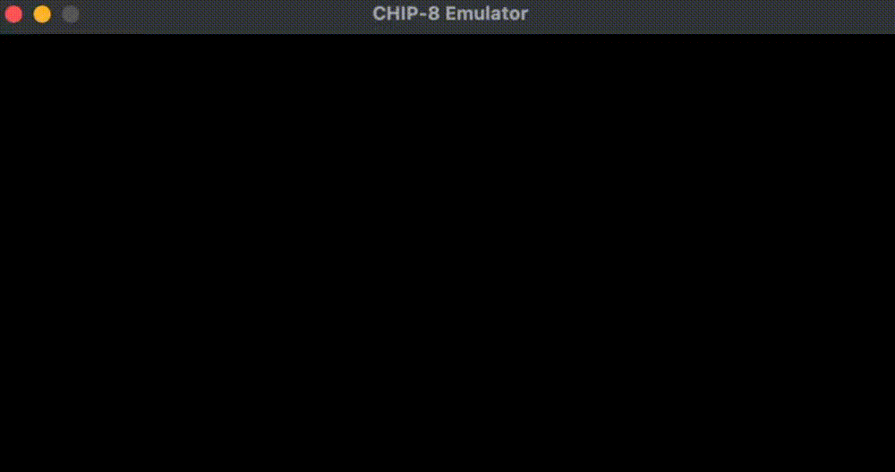

# CHIP-8 Emulator

A CHIP-8 interpreter written in C++ with SDL2 for rendering and input.

CHIP-8 is a virtual machine from the 1970s with a 64x32 monochrome display, 4K of memory, and a 34-instruction set. Programs written for it run on an interpreter, which is what this project is — it reads CHIP-8 ROMs, decodes each instruction, and emulates the machine's behavior on a modern host.



## Features

- Full 34-instruction CHIP-8 opcode set
- Function-pointer dispatch table for instruction decoding
- 64x32 monochrome display rendered with hardware-accelerated SDL2
- Full 16-key hex keypad input
- Configurable display scale and clock speed via command-line arguments

## Requirements

- A C++17 (or later) compiler — developed with `clang++`
- [SDL2](https://www.libsdl.org/)

On macOS, install SDL2 with Homebrew:

```bash
brew install sdl2
```

## Building

With the included Makefile:

```bash
make
```

Or build a debug version with AddressSanitizer (catches out-of-bounds reads/writes at runtime — very useful while developing):

```bash
make debug
```

If you'd rather compile by hand:

```bash
clang++ -std=c++20 -Wall *.cpp -o chip8 $(sdl2-config --cflags --libs)
```

## Usage

```bash
./chip8 <scale> <delay> <rom>
```

| Argument | Meaning |
|----------|---------|
| `scale`  | Integer pixel multiplier. The display is only 64x32, so a scale of `10` gives a 640x320 window. |
| `delay`  | Milliseconds between emulation cycles. Lower is faster — different games feel best at different speeds. |
| `rom`    | Path to the CHIP-8 ROM file to load. |

Example:

```bash
./chip8 10 3 roms/tetris.ch8
```

To run the included opcode test:

```bash
./chip8 10 1 tests/Test_Opcode.ch8
```

## Controls

The original CHIP-8 had a 16-key hexadecimal keypad. It's mapped onto the left side of a QWERTY keyboard:

```
CHIP-8 Keypad          Keyboard
+---+---+---+---+      +---+---+---+---+
| 1 | 2 | 3 | C |      | 1 | 2 | 3 | 4 |
+---+---+---+---+      +---+---+---+---+
| 4 | 5 | 6 | D |      | Q | W | E | R |
+---+---+---+---+  =>  +---+---+---+---+
| 7 | 8 | 9 | E |      | A | S | D | F |
+---+---+---+---+      +---+---+---+---+
| A | 0 | B | F |      | Z | X | C | V |
+---+---+---+---+      +---+---+---+---+
```

`Esc` quits the emulator.

## How it works

The core of the emulator is a **fetch-decode-execute** loop, run once per cycle:

1. **Fetch** — CHIP-8 instructions are two bytes, but memory is byte-addressed, so each opcode is assembled from `memory[pc]` and `memory[pc + 1]`. The program counter is then incremented by 2 *before* execution, since some instructions modify it.
2. **Decode** — instead of a giant `switch`, opcodes are dispatched through an array of member-function pointers. The first nibble selects a handler; opcode families that share a leading nibble (`0x0`, `0x8`, `0xE`, `0xF`) fan out into secondary tables keyed on their differing bits. Unused slots point at a no-op handler so malformed opcodes fail safely rather than jumping into garbage.
3. **Execute** — the selected handler performs the operation: arithmetic on the 16 registers, memory loads/stores, control flow, or drawing.

Graphics use XOR-based sprite drawing: each sprite pixel is XORed onto the display buffer, which is how CHIP-8 games both draw and erase sprites (and why moving objects flicker). A collision flag is set in register `VF` whenever drawing turns an already-lit pixel off. The display buffer is a `uint32` per pixel so it can be handed straight to an SDL texture.

## Project structure

```
.
├── chip8.h       # Chip8 class + SDL Platform layer (declarations + inline dispatch)
├── chip8.cpp     # Constructor, ROM loading, fetch-decode-execute, all opcode handlers
├── main.cpp      # Argument parsing and the main loop
├── Makefile
├── LICENSE
├── README.md
├── demo.gif
└── tests/
    ├── LICENSE              # corax89's MIT license for the test ROM
    └── Test_Opcode.ch8
```

## References

- [Austin Morlan — *Building a CHIP-8 Emulator [C++]*](https://austinmorlan.com/posts/chip8_emulator/) — the tutorial this project follows.
- [Cowgod's Chip-8 Technical Reference](http://devernay.free.fr/hacks/chip8/C8TECH10.HTM) — the canonical opcode reference.
- [corax89/chip8-test-rom](https://github.com/corax89/chip8-test-rom) — the opcode test ROM in `tests/`.

## License

This project is released under the MIT License — see [LICENSE](LICENSE).

The test ROM in `tests/` (`Test_Opcode.ch8`) is **not** my work. It is the CHIP-8 opcode test by [corax89](https://github.com/corax89/chip8-test-rom), used under the MIT License (Copyright © 2019 corax89). Its license is included in `tests/` alongside the ROM.
